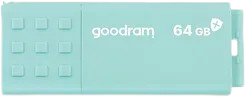

## My devices

If you want to know about the experience of using these devices, custom firmware, etc. - you can feel free to ask me 🙌

|               |                                                                                                         Device                                                                                                          |     Model     |                                               OS                                                |  Codename  |                                               Product Page                                                |
| :------------ | :---------------------------------------------------------------------------------------------------------------------------------------------------------------------------------------------------------------------: | :-----------: | :---------------------------------------------------------------------------------------------: | :--------: | :-------------------------------------------------------------------------------------------------------: |
| <kbd>🟢</kbd> |                                             **ASUS Vivobook Pro 15**                                             |  **K6502HC**  |                                           Windows 11                                            |     -      |      [Link](https://www.asus.com/au/laptops/for-creators/vivobook/asus-vivobook-pro-15-oled-k6502/)       |
| <kbd>🟢</kbd> |                               **Redmi 10C**                               | **220333QNY** | [MIUI 14 (EU) (modified)](https://github.com/okineadev/Redmi-10C-MIUI-patches), Pixel OS before |   `fog`    |                            [Link](https://www.mi.com/global/product/redmi-10c)                            |
| <kbd>🟢</kbd> |                          **Galaxy Watch 7 (44mm)**                         |  **SM-L310**  |                                         Stock One UI 6                                          | `fresh7bl` | [Link](https://www.samsung.com/za/watches/galaxy-watch/galaxy-watch7-44mm-green-bluetooth-sm-l310nzgaxfa) |
| <kbd>🟢</kbd> |  **JBL TUNE 710BT** |               |                                                                                                 |     -      |                                [Link](https://www.jbl.com/TUNE710BT-.html)                                |
| <kbd>🟢</kbd> |                                                                       **GOODRAM UME3 CARE USB**                                                                      |               |                                                                                                 |     -      |                      [Link](https://www.goodram.com/en/products/usb-3-0-ume3_care/)                       |

#### Legend:

- <kbd>🟢</kbd> - Device currently in use
- <kbd>🔴</kbd> - Device not used anymore
